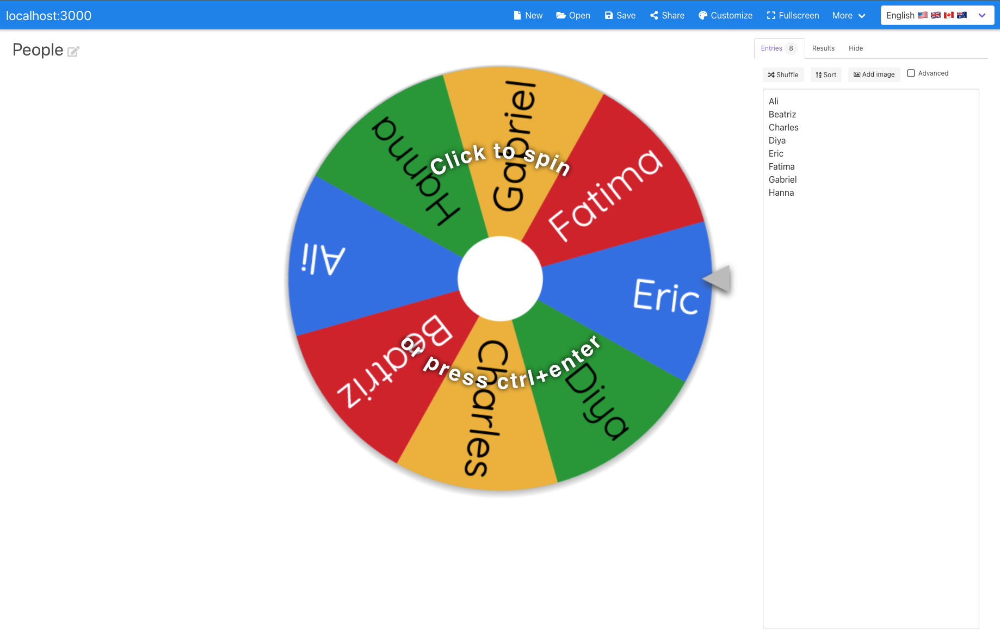

# Wheel Spinner

Wheel Spinner is a fun interactive spinning wheel web application for random selection.

## Features

- Interactive spinning wheel with cool animated effects
- Sound syncs up perfectly with visuals
- Customizable colors, images, sounds, and more
- Save and share wheels via short links
- Optional quick removal after spin to prevent repeat winners
- Dark mode support
- 6 language locales

## Architecture

See `CLAUDE.md` for detailed architecture and development guidelines.

- **Frontend**: Vue.js 2 SPA with canvas-based wheel rendering
- **Backend**: Express API + SQLite database
- **Database**: backend/data/wheelspinner.db (auto-created on first run)

## Quick Start

- [docs/quickstart.md](docs/quickstart.md) - local development and project setup
- [docs/docker.md](docs/docker.md) - docker guide with recommended deployment instructions

## Project history

This project was originally built using Firebase/GCP backend for [wheelofnames](https://wheelofnames.com). 
You can find the original forked project at [github.com/momander/wheel-spinner](https://github.com/momander/wheel-spinner).
This fork has been migrated to use Express + SQLite for self-hosting support.
See `.agents/implementation-reports/replace-firebase-with-express-sqlite.md` for
migration details. 

## License

Apache 2.0 - Originally a Google-sponsored open source project.

**This is not an officially supported Google product.**

